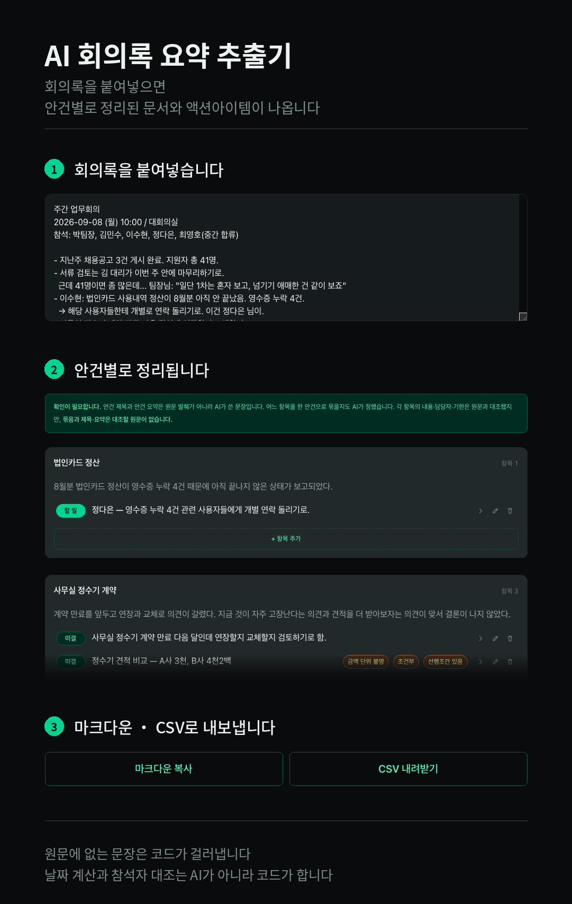

# 회의록 추출기 (minutes-to-actions)



- 배포 링크 : https://minutes-to-actions-alpha.vercel.app
- **회의록 정리 자동화 LLM 웹앱 · 추출 정확도 92.7%(38/41) · 환각 자동 차단 · 3일 1인 개발**

## 1. 실행 방법 · 기술 스택

```bash
npm install
npm run dev          # 개발 서버 (API는 배포본으로 프록시)
npm test             # 단위 테스트 100개
npm run typecheck    # 타입 검사
npm run lint         # oxlint
npm run regression   # 배포본 회귀 측정
```

| 구분 | 사용 기술 |
|---|---|
| 프론트 | React 19, Vite, TypeScript |
| 서버 | Vercel Functions (Node) |
| 모델 | OpenAI Responses API, strict Structured Outputs |
| 테스트 | node:test + tsx, oxlint |
| 배포 | Vercel |


## 2. 문제 정의

### 왜 만들었나요?

-  AI 업무 자동화 엔지니어 담당 업무 중에 "회의록 정리 자동화"를 봤습니다. 기존 AI로 회의록을 요약할 수는 있지만 회사에 그대로 적용할 수 없다는 문제 사항을 확인하고 해당 문제를 해결하기 위해서 웹 앱을 만들었습니다.

### 왜 회사는 시중에 회의록 요약 기능이 있는 앱을 쓰지 않고 굳이 AI 개발자를 따로 고용하려고 할까?
- 해결 방법
  - 시중에 나와있는 회의록 요약 어플리케이션을 찾아봤습니다. 클로바 노트, 에이닷 노트, 노션의 앱을 실제로 사용해보고 직접 애로사항을 확인했습니다.
- 결론
  1. **보안을 위해서** 회의록 앱은 데이터를 AWS에 저장합니다. 서버를 회사에 따로 둘 정도로 보안이 중요한 경우에는 회사의 정보가 모두 들어가는 회의록을 기존 상품에 저장하기엔 위험성이 있습니다. 개인이 클로드나 Chat-GPT에 요약을 한다면 특히나 더 보안상 이슈가 큽니다.
  2. **회사에서 이미 사용중인 앱과 연동하기 위해서** 클로바 노트는 네이버 웍스랑 연동성이 좋고 에이닷 노트는 앱 어플리케이션은 SKT 고객 한정으로 사용할 수 있습니다. 만약 기존에 회의록 기록을 노션이나 다른 곳에서 저장하고 있다면 매번 옮기기 번거로울 것입니다. 따로 사용하는 앱의 연동은 개발자가 아니면 하기 힘듭니다.
  3. **개발자가 아닌 직원까지도 손쉽게 프롬프트를 공유해서 사용하기 위해서** 개인도 AI를 사용하여 회의록 요약 정도는 쉽게 할 수 있습니다. (여기서 보안상 이슈는 제외합니다) 문제는 각자 다른 프롬프트를 사용해서 나오는 형태가 다 다르다는 점입니다. 그렇기에 같은 프롬프트를 사용하는 LLM기반 웹사이트가 하나 있다면 모두 같은 형태의 회의록 요약을 가질 수 있습니다.

### 어떤 앱을 필요할까?
- 해결 방법
  - 회사에 AI 개발자가 필요한 이유를 기반으로 필요한 기능을 정의했습니다.
- 결론
   - **서버에 데이터를 저장하지 않는 LLM 기반의 회의록 추출 앱**을 개발하기로 결정했습니다. 데이터를 저장하기 시작하면 보안에 신경쓸 부분이 많아지는 동시에 개발 비용도 많이 듭니다. 이는 회사가 원하는 방향이 아니라고 판단했습니다. 다만 현재 회의록 본문은 openAI API로 전송됩니다.(로컬 AI 개발 환경을 만들 수가 없어서 선택했습니다) 하지만 이 앱에는 남는 데이터가 없습니다. 혹시나 나중에 모델을 Azure OpenAI나 ollama로 바꿔도 교체 비용이 작도록 호출 어댑터는 하나만 설정했습니다.
   - **개발자가 아니여도 손쉽게 마크다운 문법이나 CSV 형태로 회의록을 뽑아낼 수 있도록 했습니다.** 마크다운 문법을 사용하면 노션으로, CSV를 사용하면 구글 스프레드 시트로 확장하기도 쉬워서 두 가지 방법을 채택했습니다.
 

## 3. 어떻게 만들었나?

### 구현 순서 

| 순서 | 단계 | 이때 정한 것 |
|---|---|---|
| 1 | 출력 스키마 | 회의록에서 어떤 내용을 뽑을지 어떤 내용을 AI가 채워 넣을지 데이터 타입까지 결정 |
| 2 | API | api로 openai를 호출합니다. 이때 모델·추론 강도는 환경변수로 빼놔서 교체 비용을 낮췄습니다 |
| 3 | 화면 | 결과를 항목 카드 목록이 아니라 회의록 문서 형태로 보여주기 |
| 4 | 되묻기 | 확신하지 못하는 칸은 사람에게 다시 물어보기. 고칠 때 레이아웃이 출렁이지 않게 |
| 5 | 내보내기 | 마크다운(노션) 먼저, CSV(스프레드시트) 나중 |

 
### 어떤 데이터를 뽑아낼까?

- 해결 방법
   - 앱에서 데이터를 어떤 형태로 추출할지 정의하기 위해 직접 회의록의 필수 요소를 찾아봤습니다. 

- 결론
    - 회의록은 프로젝트(안건)을 진행하기 위해서 모인 자리기에 첫 번째로 어떤 프로젝트인지가 가장 중요하다고 판단했습니다. 그렇기에 안건 별로 담당자, 시간, 진행 상황을 배정하는 방식으로 데이터 플로우 패턴을 짰습니다.

### 만약 AI가 틀리면 어떡하지?

- **최대한 오류를 줄이자**  함정이 많은 더미 데이터를 넣어서 직접 결과를 테스트했습니다. AI에서 걸러내지 못한 패턴은 코드로 직접적으로 명시했습니다.

- **속도보다 정확성** 만일 해야할 일을 빼버리거나 해야하지 않아도 될 일을 추가해버린다면 회사 일정에 큰 차질이 생깁니다. 그렇기에 사람이 마지막으로 직접 확인하는 프로세스를 추가하고 할일, 미결, 결정 목록을 가져온 이유를 원문 그대로 보여줬습니다. 
  
### 발췌는 AI가 판단은 코드가

- AI는 종종 실수를 합니다. 기존에 사용하던 회사 시스템에 AI를 대입할 때 **AI가 실수해도 사람이 알아차리는 것이 중요합니다**. 그렇기에 AI의 역할을 최소한했습니다. 입력받은 텍스트를 정해진 형식에 맞춰서 출력하도록 프롬프트를 짰습니다. 
- **AI가 하는 일과 코드가 하는 일을 분리해놨습니다.** AI는 입력된 텍스트에 TPO와 안건을 찾아내기만 하고 코드는 이후에 날짜 계산과 담당자 배정 등을 처리합니다. 즉, AI는 무엇이 적혀있는지 찾고, 코드는 어떤게 문제인지 판정합니다. 행위를 분리해놨기에 lib에 주요 로직을 순수함수로 분리할 수 있었습니다. 그렇기에 api를 사용해서 토큰을 쓸 필요 없이 로컬에서 테스트를 돌릴 수 있습니다.
- 예외 사항이 있습니다. 안건 제목과 요약 같은 경우에는 AI가 직접 관여합니다. 대신 화면에 확인이 필요하다는 메세지를 적어두고 사람이 내용을 수정 가능하도록 했습니다. 

## 4. 어떻게 AI의 데이터가 틀리지 않았음을 검증했나요?

총 3가지 방법을 사용했습니다.

### 1. 환각 탐지

추출한 회의록 항목들은 원문 인용을 함께 제출하도록 구성했습니다. 
모든 항목은 회의록 원문 인용(`quote`)을 함께 제출해야 합니다. 코드는 해당 문장이 원문에 그대로 존재하는지 확인하여 떼어냅니다. AI가 지어낸 문장은 결과에서 따로 분리해서 환각이 나타나지 않도록 했습니다.

### 2. 단위 테스트 100개  

판정 및 변환은 AI 추론이 들어가지 않은 순수 함수라서 API 호출 없이 테스트가 가능합니다.

```bash
npm test
```

| 파일 | 무엇을 검증하나 |
|---|---|
| `date.test.ts` | 상대·역산 날짜 환산, 기준일 우선순위 |
| `postprocess.test.ts` | 환각 제거, 검토 사유 판정, 번복 항목 접기 |
| `people.test.ts` | 참석자 대조, 동명이인, 1인칭 |
| `verify.test.ts` | 인용문 원문 대조 |
| `edit.test.ts` | 사람이 고친 값의 반영 규칙 |
| `export-markdown.test.ts` / `export-csv.test.ts` | 내보내기 형식 |


### 3. 회귀 측정 (수동, 배포본 기준)

```bash
npm run regression
```

일부러 함정을 넣어둔 테스트용 회의록 5건을 배포된 API에 넣습니다. 그리고 정답지와 대조하여 직접 채점합니다. 인간이 판단할 영역이기에 이 부분은 AI가 가능한 영역까지만 자동화 시켜놨습니다. 

| 회차 | 합계 | 변경사항 |
|---|---|---|
| 1차 | 18/31 | LLM 최초 연결 |
| 2차 | 23/31 | 날짜 파서 결함 2건 수정 + 프롬프트 개편 |
| 3차 | 22/31 | AI 판정을 코드로 이동 |
| 5차 | 29/31 | TPO 3칸 추가 |
| 6차 | **38/41** | 안건 계층 도입.  |


